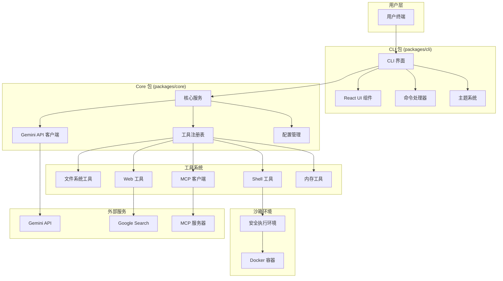
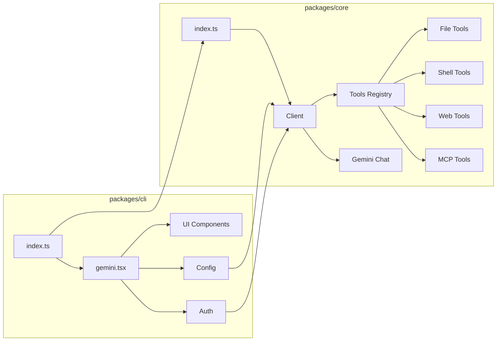
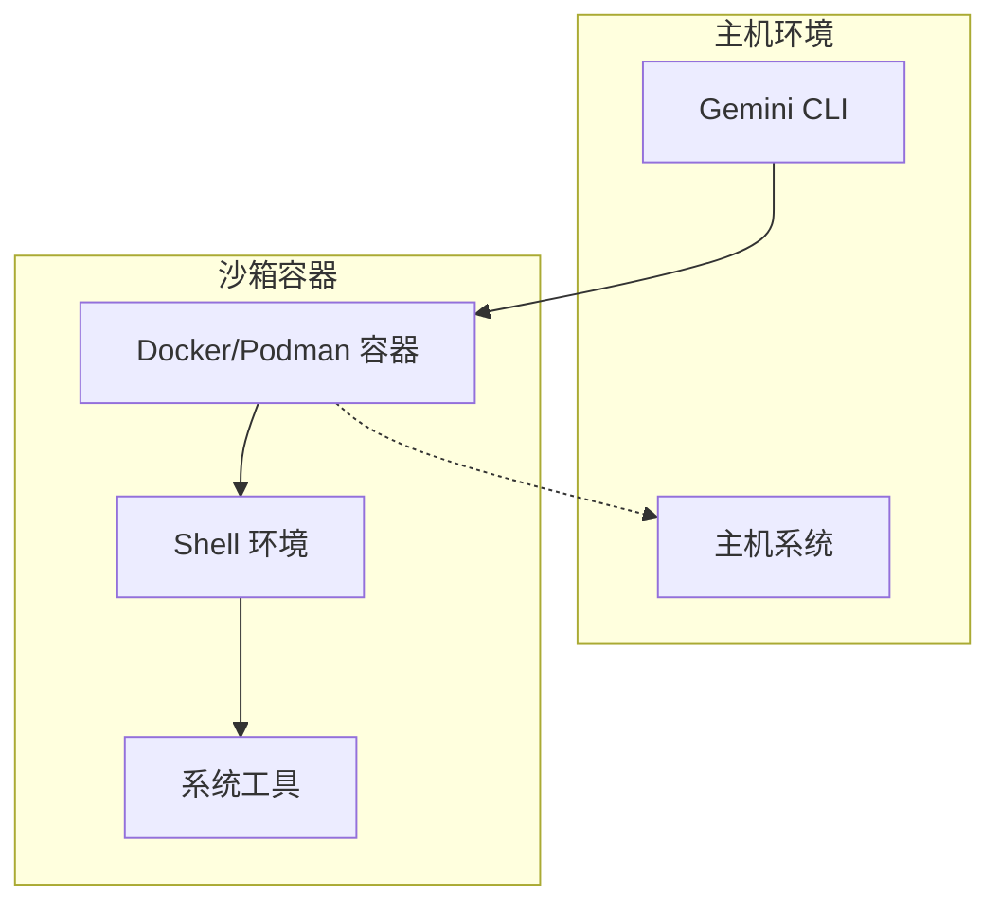
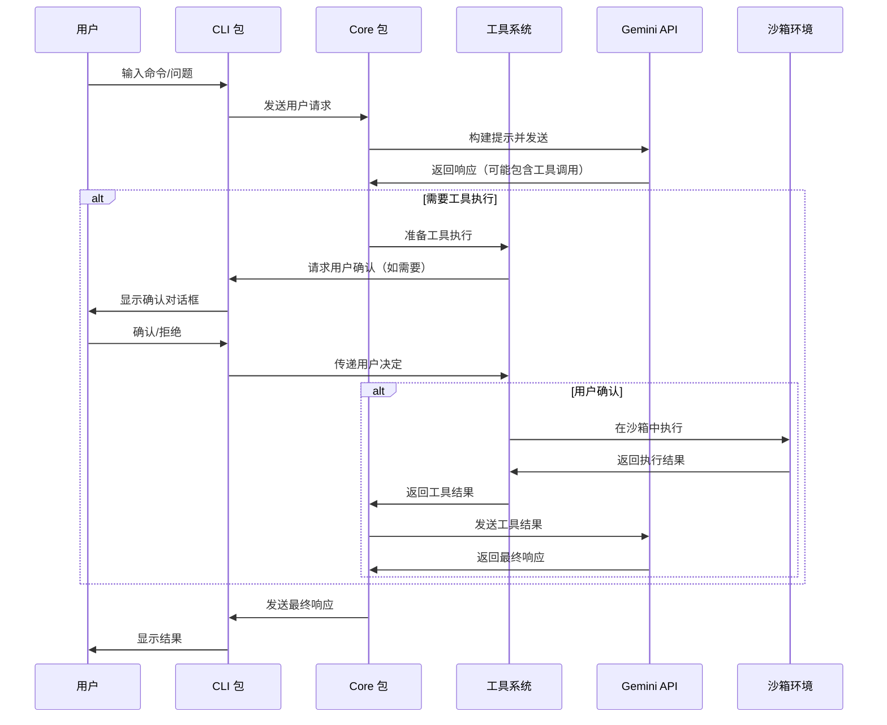
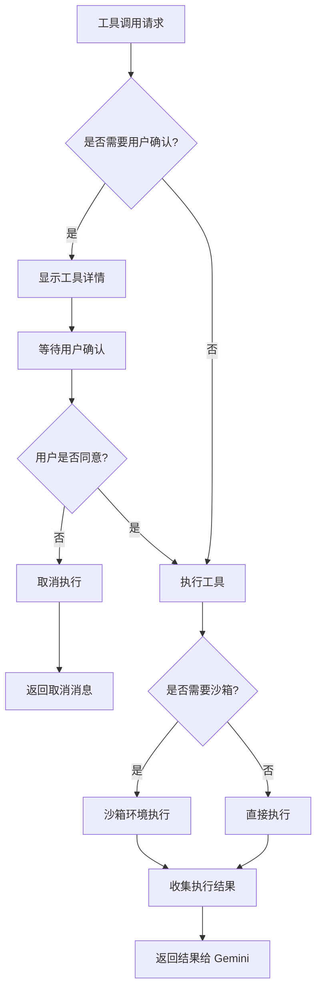
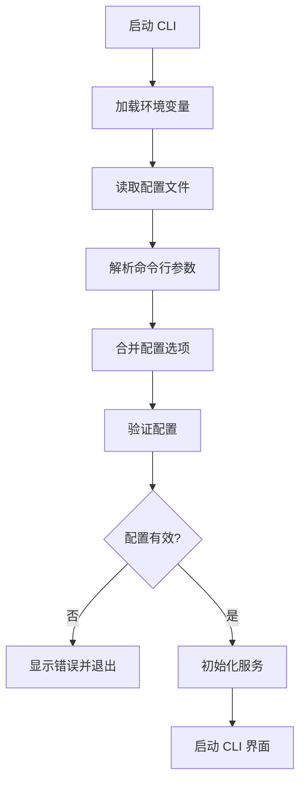
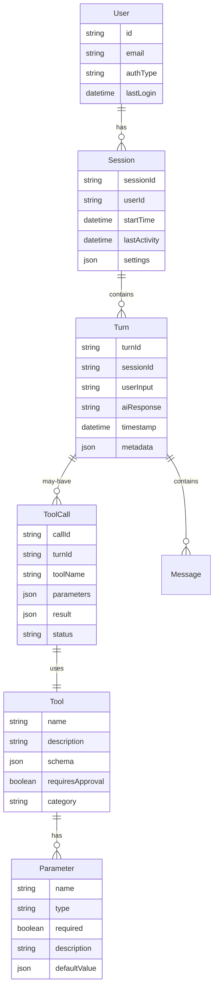
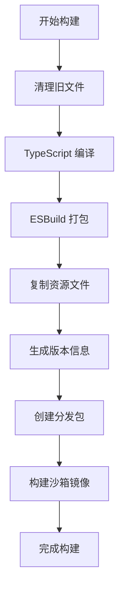

# Gemini CLI 技术文档

## 目录

- [项目概述](#项目概述)
- [技术栈说明](#技术栈说明)
- [项目架构设计](#项目架构设计)
- [目录结构详细说明](#目录结构详细说明)
- [安装和运行指南](#安装和运行指南)
- [核心功能模块详解](#核心功能模块详解)
- [数据流程说明](#数据流程说明)
- [API接口文档](#api接口文档)
- [配置文件说明](#配置文件说明)
- [开发指南和最佳实践](#开发指南和最佳实践)
- [常见问题和故障排除](#常见问题和故障排除)

## 项目概述

### 什么是 Gemini CLI？

Gemini CLI 是由 Google 开发的命令行AI工作流工具，它将 Gemini 模型的强大功能带到您的终端中。通过交互式的 REPL（读取-求值-打印循环）环境，您可以：

- **代码库分析**：在 Gemini 的 1M token 上下文窗口内查询和编辑大型代码库
- **多模态生成**：利用 Gemini 的多模态能力从 PDF 或草图生成新应用
- **工作流自动化**：自动化操作任务，如查询拉取请求或处理复杂的代码重构
- **工具集成**：使用工具和 MCP 服务器连接新功能，包括媒体生成
- **信息检索**：通过内置的 Google Search 工具为查询提供实时信息支持

### 核心特性

- 🚀 **高性能**：支持大型代码库的快速分析和处理
- 🔧 **可扩展**：通过 MCP（Model Context Protocol）支持自定义工具
- 🛡️ **安全**：沙箱环境确保代码执行的安全性
- 🎨 **用户友好**：丰富的终端界面和主题定制
- 🌐 **多功能**：文件系统操作、Web 获取、Shell 命令执行等

## 技术栈说明

### 前端技术栈

- **Node.js 18+**：运行时环境
- **TypeScript**：主要编程语言，提供类型安全
- **React**：用于构建终端UI组件
- **Ink**：React 的终端渲染器
- **ESBuild**：快速的 JavaScript 打包工具

### 后端技术栈

- **@google/genai**：Google Gemini API 客户端
- **@modelcontextprotocol/sdk**：MCP 协议支持
- **google-auth-library**：Google 认证库
- **OAuth2**：用户认证机制

### 开发工具链

- **Vitest**：现代化测试框架
- **ESLint**：代码质量检查
- **Prettier**：代码格式化
- **TypeScript Compiler**：类型检查和编译

### 容器化技术

- **Docker/Podman**：容器运行时
- **沙箱环境**：安全的代码执行环境
- **macOS Seatbelt**：macOS 平台的沙箱支持

### 依赖管理

- **npm workspaces**：多包管理
- **package-lock.json**：依赖版本锁定
- **自动化脚本**：构建、测试、发布流程

## 项目架构设计

### 系统架构图



### 组件关系图



## 目录结构详细说明

```
gemini-cli/
├── packages/                    # 主要代码包
│   ├── cli/                    # CLI 前端包
│   │   ├── src/               # CLI 源代码
│   │   │   ├── gemini.tsx     # 主入口文件
│   │   │   ├── ui/            # React UI 组件
│   │   │   ├── config/        # CLI 配置
│   │   │   └── utils/         # CLI 工具函数
│   │   ├── index.ts           # 包入口点
│   │   └── package.json       # CLI 包配置
│   └── core/                  # Core 后端包
│       ├── src/               # Core 源代码
│       │   ├── core/          # 核心逻辑
│       │   ├── tools/         # 工具实现
│       │   ├── services/      # 服务层
│       │   ├── utils/         # 工具函数
│       │   └── config/        # 配置管理
│       ├── index.ts           # 包入口点
│       └── package.json       # Core 包配置
├── docs/                      # 项目文档
│   ├── architecture.md        # 架构文档
│   ├── cli/                   # CLI 文档
│   ├── core/                  # Core 文档
│   └── tools/                 # 工具文档
├── scripts/                   # 构建和部署脚本
│   ├── build.js              # 主构建脚本
│   ├── build_package.js      # 包构建脚本
│   └── build_sandbox.js      # 沙箱构建脚本
├── integration-tests/         # 集成测试
├── bundle/                    # 打包输出目录
├── Dockerfile                 # Docker 配置
├── package.json              # 根包配置
├── tsconfig.json             # TypeScript 配置
├── esbuild.config.js         # ESBuild 配置
└── Makefile                  # Make 构建配置
```

### 关键目录说明

#### `packages/cli/`
- **作用**：用户界面层，处理用户输入和输出显示
- **核心文件**：
  - `gemini.tsx`：主应用入口，包含 React 组件
  - `ui/`：终端 UI 组件库
  - `config/`：CLI 特定配置（主题、设置等）

#### `packages/core/`
- **作用**：业务逻辑层，处理 API 调用和工具执行
- **核心文件**：
  - `core/client.ts`：Gemini API 客户端
  - `tools/`：各种工具实现
  - `services/`：Git 服务、文件发现服务等

#### `scripts/`
- **作用**：自动化构建和部署脚本
- **核心脚本**：
  - `build.js`：主构建流程
  - `build_sandbox.js`：沙箱镜像构建
  - `start.js`：开发环境启动

## 安装和运行指南

### 环境要求

#### 必需环境
- **Node.js**：版本 18 或更高
- **npm**：Node.js 自带的包管理器
- **操作系统**：Linux、macOS 或 Windows（WSL 推荐）

#### 可选环境（推荐）
- **Docker**：用于沙箱环境（推荐）
- **Podman**：Docker 的替代方案
- **Git**：版本控制和检查点功能

### 快速开始

#### 方法一：直接运行（推荐新用户）

```bash
# 直接从 GitHub 运行最新版本
npx https://github.com/google-gemini/gemini-cli
```

#### 方法二：全局安装

```bash
# 安装到全局环境
npm install -g @google/gemini-cli

# 运行 CLI
gemini
```

### 认证设置

#### 个人用户认证（推荐）

1. 启动 CLI 后，系统会自动引导您进行 Google 账户认证
2. 这将为您提供每分钟 60 次请求和每天 1,000 次请求的限制

#### API 密钥认证（高级用户）

```bash
# 1. 从 Google AI Studio 获取 API 密钥
# 访问：https://aistudio.google.com/apikey

# 2. 设置环境变量
export GEMINI_API_KEY="your_api_key_here"

# 3. 启动 CLI
gemini
```

### 沙箱环境配置（推荐）

沙箱环境提供安全的代码执行环境，强烈推荐启用：

```bash
# 设置沙箱环境变量
export GEMINI_SANDBOX=true

# 或者指定特定的容器引擎
export GEMINI_SANDBOX=docker  # 或 podman
```

### 开发环境设置

如果您想从源代码构建和运行：

```bash
# 1. 克隆仓库
git clone https://github.com/google-gemini/gemini-cli
cd gemini-cli

# 2. 安装依赖
npm install

# 3. 构建项目
npm run build

# 4. 启动开发版本
npm start
```

## 核心功能模块详解

### 文件系统工具模块

文件系统工具是 Gemini CLI 的核心功能之一，提供了完整的文件操作能力。

#### 主要工具

1. **`list_directory` (LSTool)**
   - **功能**：列出目录内容
   - **用法**：`ls /path/to/directory`
   - **特性**：支持递归列表、文件类型识别

2. **`read_file` (ReadFileTool)**
   - **功能**：读取单个文件内容
   - **用法**：自动检测文件类型和编码
   - **支持格式**：文本文件、JSON、YAML、Markdown 等

3. **`write_file` (WriteFileTool)**
   - **功能**：写入文件内容
   - **安全性**：需要用户确认
   - **特性**：自动创建目录、备份现有文件

4. **`read_many_files` (ReadManyFilesTool)**
   - **功能**：批量读取多个文件
   - **用法**：支持 glob 模式匹配
   - **优化**：智能内容聚合和格式化

5. **`edit` (EditTool)**
   - **功能**：就地编辑文件
   - **安全性**：显示差异，需要用户确认
   - **特性**：支持多种编辑操作

#### 代码示例

```typescript
// 文件读取工具的基本结构
export class ReadFileTool extends BaseTool {
  name = 'read_file';
  description = '读取文件内容';

  async execute(params: ReadFileParams): Promise<ToolResult> {
    const { absolute_path } = params;
    // 安全性检查
    this.validatePath(absolute_path);
    // 读取文件内容
    const content = await fs.readFile(absolute_path, 'utf-8');
    return { content, llmContent: content };
  }
}
```

### Shell 工具模块

Shell 工具允许 Gemini 执行系统命令，是自动化工作流的关键组件。

#### 核心特性

- **安全执行**：所有命令都在沙箱环境中运行
- **用户确认**：危险命令需要用户明确批准
- **输出捕获**：实时捕获命令输出和错误
- **超时控制**：防止长时间运行的命令

#### 沙箱环境



### Web 工具模块

Web 工具扩展了 Gemini CLI 的网络能力，支持信息检索和内容获取。

#### 主要工具

1. **`web_fetch` (WebFetchTool)**
   - **功能**：获取网页内容
   - **特性**：HTML 到 Markdown 转换
   - **支持**：自动处理重定向、cookies

2. **`google_web_search` (WebSearchTool)**
   - **功能**：Google 搜索集成
   - **特性**：实时搜索结果
   - **用途**：为查询提供最新信息

### MCP 客户端模块

MCP（Model Context Protocol）客户端支持与外部服务的集成。

#### 支持的传输方式

- **Stdio**：标准输入输出通信
- **SSE**：服务器发送事件
- **HTTP**：HTTP 流式传输

#### 配置示例

```json
{
  "mcpServers": {
    "filesystem": {
      "command": "npx",
      "args": ["@modelcontextprotocol/server-filesystem", "/path/to/allowed/files"]
    },
    "web-search": {
      "url": "sse://localhost:3001/sse"
    }
  }
}
```

### 内存工具模块

内存工具提供跨会话的信息持久化能力。

#### 功能特性

- **会话记忆**：保存重要信息到本地文件
- **智能检索**：基于上下文的信息查找
- **格式化存储**：Markdown 格式的结构化存储

## 数据流程说明

### 用户交互完整流程



### 工具执行流程



### 配置加载流程



## API接口文档

### 核心 API 架构

Gemini CLI 的 API 架构基于工具调用模式，通过 Gemini API 与各种工具进行交互。

#### API 数据模型



### 工具 API 接口

#### 文件系统工具 API

##### 1. 读取文件 (`read_file`)

**请求格式：**
```json
{
  "tool": "read_file",
  "parameters": {
    "absolute_path": "/path/to/file.txt"
  }
}
```

**响应格式：**
```json
{
  "success": true,
  "content": "文件内容...",
  "metadata": {
    "size": 1024,
    "mimeType": "text/plain",
    "encoding": "utf-8",
    "lastModified": "2025-01-15T10:30:00Z"
  }
}
```

##### 2. 写入文件 (`write_file`)

**请求格式：**
```json
{
  "tool": "write_file",
  "parameters": {
    "absolute_path": "/path/to/output.txt",
    "content": "要写入的内容",
    "create_directories": true
  }
}
```

**响应格式：**
```json
{
  "success": true,
  "message": "文件写入成功",
  "metadata": {
    "bytesWritten": 256,
    "created": true
  }
}
```

##### 3. 列出目录 (`list_directory`)

**请求格式：**
```json
{
  "tool": "list_directory",
  "parameters": {
    "absolute_path": "/path/to/directory",
    "recursive": false,
    "include_hidden": false
  }
}
```

**响应格式：**
```json
{
  "success": true,
  "entries": [
    {
      "name": "file.txt",
      "type": "file",
      "size": 1024,
      "modified": "2025-01-15T10:30:00Z",
      "permissions": "rw-r--r--"
    },
    {
      "name": "subdirectory",
      "type": "directory",
      "size": 4096,
      "modified": "2025-01-15T09:15:00Z",
      "permissions": "rwxr-xr-x"
    }
  ]
}
```

#### Shell 工具 API

##### 执行命令 (`run_shell_command`)

**请求格式：**
```json
{
  "tool": "run_shell_command",
  "parameters": {
    "command": "ls -la",
    "working_directory": "/workspace",
    "timeout": 30000,
    "capture_output": true
  }
}
```

**响应格式：**
```json
{
  "success": true,
  "stdout": "命令输出...",
  "stderr": "",
  "exitCode": 0,
  "executionTime": 1250,
  "metadata": {
    "pid": 12345,
    "sandbox": true
  }
}
```

#### Web 工具 API

##### 1. 获取网页 (`web_fetch`)

**请求格式：**
```json
{
  "tool": "web_fetch",
  "parameters": {
    "url": "https://example.com",
    "format": "markdown",
    "timeout": 10000
  }
}
```

**响应格式：**
```json
{
  "success": true,
  "content": "# 网页标题\n\n网页内容...",
  "metadata": {
    "title": "网页标题",
    "statusCode": 200,
    "contentType": "text/html",
    "size": 2048
  }
}
```

##### 2. 网络搜索 (`google_web_search`)

**请求格式：**
```json
{
  "tool": "google_web_search",
  "parameters": {
    "query": "TypeScript 最佳实践",
    "num_results": 5,
    "language": "zh-CN"
  }
}
```

**响应格式：**
```json
{
  "success": true,
  "results": [
    {
      "title": "TypeScript 最佳实践指南",
      "url": "https://example.com/typescript-best-practices",
      "snippet": "本文介绍了 TypeScript 开发的最佳实践...",
      "rank": 1
    }
  ],
  "metadata": {
    "totalResults": 1250000,
    "searchTime": 0.45
  }
}
```

### 内部 API 接口

#### 配置管理 API

```typescript
interface ConfigAPI {
  // 获取配置
  getConfig(): Promise<Config>;

  // 更新配置
  updateConfig(updates: Partial<Config>): Promise<void>;

  // 重置配置
  resetConfig(): Promise<void>;

  // 验证配置
  validateConfig(config: Config): ValidationResult;
}
```

#### 工具注册 API

```typescript
interface ToolRegistryAPI {
  // 注册工具
  registerTool(tool: BaseTool): void;

  // 获取工具
  getTool(name: string): BaseTool | undefined;

  // 列出所有工具
  listTools(): ToolInfo[];

  // 发现 MCP 工具
  discoverTools(): Promise<void>;
}
```

#### 会话管理 API

```typescript
interface SessionAPI {
  // 创建会话
  createSession(userId: string): Promise<Session>;

  // 获取会话
  getSession(sessionId: string): Promise<Session | null>;

  // 更新会话
  updateSession(sessionId: string, updates: Partial<Session>): Promise<void>;

  // 删除会话
  deleteSession(sessionId: string): Promise<void>;
}
```

### 错误处理

#### 标准错误格式

```json
{
  "success": false,
  "error": {
    "code": "TOOL_EXECUTION_FAILED",
    "message": "工具执行失败",
    "details": {
      "toolName": "read_file",
      "reason": "文件不存在",
      "path": "/nonexistent/file.txt"
    },
    "timestamp": "2025-01-15T10:30:00Z"
  }
}
```

#### 错误代码表

| 错误代码 | 描述 | 解决方案 |
|---------|------|----------|
| `AUTH_FAILED` | 认证失败 | 检查 API 密钥或重新登录 |
| `TOOL_NOT_FOUND` | 工具不存在 | 检查工具名称拼写 |
| `PERMISSION_DENIED` | 权限被拒绝 | 检查文件权限或用户授权 |
| `TIMEOUT` | 操作超时 | 增加超时时间或检查网络 |
| `INVALID_PARAMETERS` | 参数无效 | 检查参数格式和类型 |
| `SANDBOX_ERROR` | 沙箱执行错误 | 检查沙箱配置和环境 |

### API 使用示例

#### JavaScript/TypeScript 客户端

```typescript
import { GeminiCLIClient } from '@google/gemini-cli-core';

// 初始化客户端
const client = new GeminiCLIClient({
  apiKey: process.env.GEMINI_API_KEY,
  sandbox: true
});

// 读取文件
const fileContent = await client.tools.readFile({
  absolute_path: '/path/to/file.txt'
});

// 执行 Shell 命令
const result = await client.tools.runShellCommand({
  command: 'npm test',
  working_directory: '/workspace'
});

// 搜索网络
const searchResults = await client.tools.googleWebSearch({
  query: 'Node.js 性能优化',
  num_results: 3
});
```

#### REST API 调用示例

```bash
# 使用 curl 调用工具
curl -X POST http://localhost:3000/api/tools/execute \
  -H "Content-Type: application/json" \
  -H "Authorization: Bearer $GEMINI_API_KEY" \
  -d '{
    "tool": "read_file",
    "parameters": {
      "absolute_path": "/path/to/file.txt"
    }
  }'
```

## 配置文件说明

### 主配置文件结构

Gemini CLI 使用多层配置系统，按优先级从高到低：

1. **命令行参数**
2. **环境变量**
3. **用户配置文件** (`~/.gemini/settings.json`)
4. **项目配置文件** (`.gemini/settings.json`)
5. **默认配置**

### 环境变量配置

#### 认证相关

```bash
# Gemini API 密钥
export GEMINI_API_KEY="your_api_key_here"

# 认证类型 (oauth|api_key)
export GEMINI_AUTH_TYPE="oauth"
```

#### 沙箱配置

```bash
# 启用沙箱环境
export GEMINI_SANDBOX=true

# 指定容器引擎
export GEMINI_SANDBOX=docker  # 或 podman

# 沙箱镜像
export GEMINI_SANDBOX_IMAGE="custom-image:latest"

# 沙箱挂载点
export SANDBOX_MOUNTS="/host/path:/container/path"

# 沙箱端口映射
export SANDBOX_PORTS="8080:8080"

# 沙箱环境变量
export SANDBOX_ENV="VAR1=value1,VAR2=value2"
```

#### 模型配置

```bash
# 默认模型
export GEMINI_MODEL="gemini-1.5-pro"

# Flash 模型
export GEMINI_FLASH_MODEL="gemini-1.5-flash"

# 嵌入模型
export GEMINI_EMBEDDING_MODEL="text-embedding-004"
```

### 用户配置文件

位置：`~/.gemini/settings.json`

```json
{
  "theme": "dark",
  "sandbox": true,
  "approvalMode": "auto",
  "model": "gemini-1.5-pro",
  "maxTokens": 1000000,
  "temperature": 0.7,
  "mcpServers": {
    "filesystem": {
      "command": "npx",
      "args": ["@modelcontextprotocol/server-filesystem", "/allowed/path"]
    }
  },
  "tools": {
    "shell": {
      "enabled": true,
      "timeout": 30000
    },
    "web": {
      "enabled": true,
      "userAgent": "Gemini-CLI/1.0"
    }
  }
}
```

### 项目配置文件

位置：`.gemini/settings.json`（项目根目录）

```json
{
  "projectName": "my-project",
  "excludePatterns": [
    "node_modules/**",
    "dist/**",
    "*.log"
  ],
  "includePatterns": [
    "src/**/*.ts",
    "docs/**/*.md"
  ],
  "customPrompts": {
    "codeReview": "请审查这段代码的质量和安全性"
  },
  "mcpServers": {
    "project-specific": {
      "command": "./scripts/mcp-server.js"
    }
  }
}
```

### 沙箱自定义配置

#### 自定义 Dockerfile

位置：`.gemini/sandbox.Dockerfile`

```dockerfile
FROM us-docker.pkg.dev/gemini-code-dev/gemini-cli/sandbox:latest

# 安装项目特定的依赖
RUN apt-get update && apt-get install -y \
    python3-pip \
    golang-go \
    && rm -rf /var/lib/apt/lists/*

# 安装 Python 包
RUN pip3 install numpy pandas matplotlib

# 设置工作目录
WORKDIR /workspace

# 复制项目配置
COPY .gemini/requirements.txt /tmp/
RUN pip3 install -r /tmp/requirements.txt
```

#### 自定义启动脚本

位置：`.gemini/sandbox.bashrc`

```bash
# 项目特定的环境设置
export PROJECT_ROOT=/workspace
export PYTHONPATH=$PROJECT_ROOT/src:$PYTHONPATH

# 别名设置
alias ll='ls -la'
alias grep='grep --color=auto'

# 自定义函数
function project_test() {
    cd $PROJECT_ROOT && npm test
}

# 启动消息
echo "欢迎使用项目沙箱环境！"
echo "项目根目录：$PROJECT_ROOT"
```

## 开发指南和最佳实践

### 开发环境设置

#### 1. 克隆和初始化

```bash
# 克隆仓库
git clone https://github.com/google-gemini/gemini-cli
cd gemini-cli

# 安装依赖
npm install

# 设置开发环境
npm run setup-dev
```

#### 2. 开发工作流

```bash
# 清理构建产物
npm run clean

# 构建项目
npm run build

# 运行测试
npm test

# 代码检查
npm run lint

# 格式化代码
npm run format

# 完整预检查
npm run preflight
```

### 构建系统详解

#### 构建流程



#### 关键构建脚本

1. **`scripts/build.js`** - 主构建脚本
2. **`scripts/build_package.js`** - 单包构建
3. **`scripts/build_sandbox.js`** - 沙箱镜像构建
4. **`esbuild.config.js`** - ESBuild 配置

### 测试策略

#### 测试类型

1. **单元测试**：使用 Vitest 框架
2. **集成测试**：测试工具和 API 集成
3. **端到端测试**：完整用户场景测试

#### 运行测试

```bash
# 运行所有测试
npm test

# 运行 CI 测试（包含覆盖率）
npm run test:ci

# 运行集成测试
npm run test:integration:all

# 运行端到端测试
npm run test:e2e
```

### 代码质量标准

#### ESLint 规则

- 使用 TypeScript ESLint 配置
- 强制类型安全
- 禁止相对跨包导入
- 要求许可证头部

#### Prettier 配置

```json
{
  "semi": true,
  "trailingComma": "all",
  "singleQuote": true,
  "printWidth": 80,
  "tabWidth": 2
}
```

### 贡献指南

#### 提交代码流程

1. **Fork 仓库**并创建功能分支
2. **编写代码**并添加测试
3. **运行预检查**：`npm run preflight`
4. **提交代码**并推送到您的 fork
5. **创建 Pull Request**

#### 提交消息规范

```
type(scope): description

body

footer
```

示例：
```
feat(tools): add new file search tool

Add a new tool for searching files by content using ripgrep.
Includes support for regex patterns and file type filtering.

Closes #123
```

#### 代码审查清单

- [ ] 代码符合项目风格指南
- [ ] 包含适当的测试用例
- [ ] 文档已更新
- [ ] 所有测试通过
- [ ] 没有引入安全漏洞
- [ ] 性能影响已评估

## 常见问题和故障排除

### 安装和启动问题

#### Q: 运行 `npx https://github.com/google-gemini/gemini-cli` 时出现错误

**A: 可能的解决方案：**

1. **检查 Node.js 版本**
   ```bash
   node --version  # 应该是 18.0.0 或更高
   ```

2. **清理 npm 缓存**
   ```bash
   npm cache clean --force
   ```

3. **使用完整的 GitHub URL**
   ```bash
   npx https://github.com/google-gemini/gemini-cli.git
   ```

#### Q: 全局安装后找不到 `gemini` 命令

**A: 解决步骤：**

1. **检查全局安装路径**
   ```bash
   npm list -g --depth=0
   npm config get prefix
   ```

2. **添加到 PATH**
   ```bash
   # 添加到 ~/.bashrc 或 ~/.zshrc
   export PATH="$(npm config get prefix)/bin:$PATH"
   ```

3. **重新安装**
   ```bash
   npm uninstall -g @google/gemini-cli
   npm install -g @google/gemini-cli
   ```

### 认证问题

#### Q: OAuth 认证失败

**A: 故障排除步骤：**

1. **检查网络连接**
   ```bash
   curl -I https://accounts.google.com
   ```

2. **清理认证缓存**
   ```bash
   rm -rf ~/.gemini/auth
   ```

3. **检查防火墙设置**
   - 确保端口 3000-3010 可用于本地回调

4. **使用 API 密钥替代**
   ```bash
   export GEMINI_API_KEY="your_api_key"
   gemini
   ```

#### Q: API 密钥认证失败

**A: 检查清单：**

- [ ] API 密钥格式正确（以 `AI` 开头）
- [ ] API 密钥未过期
- [ ] 已启用 Gemini API 服务
- [ ] 环境变量设置正确

### 沙箱环境问题

#### Q: Docker 沙箱启动失败

**A: 诊断步骤：**

1. **检查 Docker 状态**
   ```bash
   docker --version
   docker ps
   ```

2. **检查镜像是否存在**
   ```bash
   docker images | grep gemini-cli
   ```

3. **手动拉取镜像**
   ```bash
   docker pull us-docker.pkg.dev/gemini-code-dev/gemini-cli/sandbox:latest
   ```

4. **检查权限**
   ```bash
   # Linux 用户需要在 docker 组中
   sudo usermod -aG docker $USER
   # 重新登录后生效
   ```

#### Q: macOS 沙箱权限问题

**A: 解决方案：**

1. **检查 Seatbelt 配置**
   ```bash
   export SEATBELT_PROFILE=permissive-open
   ```

2. **授予文件访问权限**
   - 系统偏好设置 → 安全性与隐私 → 完全磁盘访问权限
   - 添加终端应用程序

### 工具执行问题

#### Q: Shell 命令执行超时

**A: 调整配置：**

```json
{
  "tools": {
    "shell": {
      "timeout": 60000,  // 增加到 60 秒
      "maxOutputSize": 1048576  // 1MB 输出限制
    }
  }
}
```

#### Q: 文件读取权限被拒绝

**A: 检查项目：**

1. **确认文件路径**
   ```bash
   ls -la /path/to/file
   ```

2. **检查 .gitignore 规则**
   - Gemini CLI 遵循 .gitignore 排除规则

3. **调整文件权限**
   ```bash
   chmod 644 /path/to/file
   ```

### 性能问题

#### Q: 大型代码库处理缓慢

**A: 优化建议：**

1. **使用排除模式**
   ```json
   {
     "excludePatterns": [
       "node_modules/**",
       "dist/**",
       "*.log",
       "coverage/**"
     ]
   }
   ```

2. **限制文件大小**
   ```json
   {
     "tools": {
       "readFile": {
         "maxFileSize": 1048576  // 1MB
       }
     }
   }
   ```

3. **使用增量模式**
   ```bash
   gemini --incremental
   ```

#### Q: 内存使用过高

**A: 内存优化：**

1. **调整 Node.js 内存限制**
   ```bash
   export NODE_OPTIONS="--max-old-space-size=4096"
   ```

2. **启用流式处理**
   ```json
   {
     "streaming": true,
     "chunkSize": 8192
   }
   ```

### MCP 服务器问题

#### Q: MCP 服务器连接失败

**A: 调试步骤：**

1. **检查服务器配置**
   ```json
   {
     "mcpServers": {
       "test": {
         "command": "node",
         "args": ["server.js"],
         "cwd": "/path/to/server",
         "timeout": 10000
       }
     }
   }
   ```

2. **测试服务器独立运行**
   ```bash
   cd /path/to/server
   node server.js
   ```

3. **检查日志输出**
   ```bash
   export DEBUG=mcp:*
   gemini
   ```

### 网络问题

#### Q: Web 搜索功能不可用

**A: 网络诊断：**

1. **检查网络连接**
   ```bash
   curl -I https://www.google.com
   ```

2. **配置代理（如需要）**
   ```bash
   export HTTP_PROXY=http://proxy.company.com:8080
   export HTTPS_PROXY=http://proxy.company.com:8080
   ```

3. **检查防火墙规则**
   - 确保允许 HTTPS 出站连接

### 调试技巧

#### 启用详细日志

```bash
# 启用调试模式
export DEBUG=gemini:*

# 启用详细输出
gemini --verbose

# 保存日志到文件
gemini --log-file=debug.log
```

#### 检查配置

```bash
# 显示当前配置
gemini --show-config

# 验证配置文件
gemini --validate-config
```

#### 重置环境

```bash
# 清理所有缓存和配置
rm -rf ~/.gemini

# 重新初始化
gemini --init
```

### 获取帮助

#### 官方资源

- **GitHub 仓库**：https://github.com/google-gemini/gemini-cli
- **问题报告**：https://github.com/google-gemini/gemini-cli/issues
- **文档**：https://github.com/google-gemini/gemini-cli/docs

#### 社区支持

- **Stack Overflow**：使用标签 `gemini-cli`
- **Google AI 开发者社区**：https://ai.google.dev/community

#### 报告 Bug

提交 Issue 时请包含：

1. **环境信息**
   ```bash
   gemini --version
   node --version
   npm --version
   uname -a
   ```

2. **错误日志**
   ```bash
   gemini --verbose --log-file=error.log
   ```

3. **重现步骤**
4. **预期行为 vs 实际行为**

---

## 学习资源

### 技术文档

- **TypeScript 官方文档**：https://www.typescriptlang.org/docs/
- **Node.js 文档**：https://nodejs.org/docs/
- **React 文档**：https://react.dev/
- **Docker 文档**：https://docs.docker.com/

### Gemini API

- **Gemini API 文档**：https://ai.google.dev/gemini-api/docs
- **Google AI Studio**：https://aistudio.google.com/
- **API 参考**：https://ai.google.dev/api

### MCP 协议

- **MCP 规范**：https://modelcontextprotocol.io/
- **MCP SDK**：https://github.com/modelcontextprotocol/typescript-sdk
- **示例服务器**：https://github.com/modelcontextprotocol/servers

---

*本文档持续更新中，如有问题或建议，请提交 Issue 或 Pull Request。*
